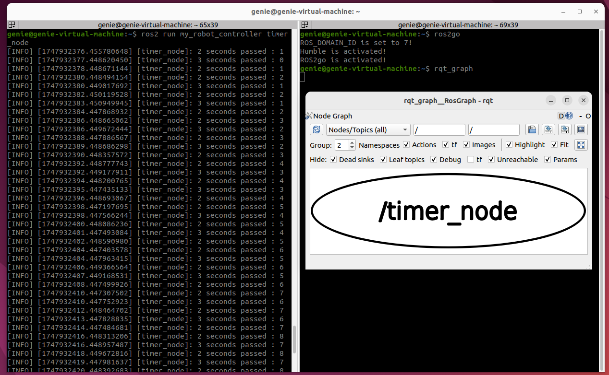

# 수행 목표
ROS2의 타이머와 콜백 사용법을 학습한다.

# 지속적으로동작하는 로봇을 만들기 위해서 ROS2에서는 타이머 기능을 제공한다.
# ROS2의 타이머 개념 및 타이머를 생성, 사용하는 방법에 대해서 학습한다.
 - ROS2 타이머는 정해진 시간 간격으로 특정 동작(함수)을 자동으로 실행하도록 하는 기능이다.
 - **센서 데이터를 주기적으로 읽거나 주기적인 제어 명령을 보내야 할 때 사용**된다.
 - **rclpy에서는 create_timer() 메서드를 사용해 타이머를 생성하며, 타이머는 지정된 주기마다 콜백 함수를 호출**한다.
 - **타이머 생성 방법**
     - **self.create_timer(timer_period_sec, callback_function)**
     - **timer_period_sec**: 타이머 주기 (초 단위, float)
     - **callback_function**: 타이머가 주기적으로 실행할 함수

## 1. 파이썬 또는 일반적인 프로그래밍에서 콜백함수의 개념에 대해서 학습한다.
 - **콜백 함수는 전달인자로 다른 함수에 전달되어 특정 이벤트나 조건이 발생했을 때 호출되어 실행**된다.
 - 동기식 콜백은 외부 함수 호출 직후에 호출되고, 비동기식 콜백은 비동기 작업이 완료된 후 나중에 호출된다.
 - **Python에서는 함수도 객체로 취급되므로, 다른 함수에 인자로 넘기거나 특정 시점에 호출할 수 있다.**

## 2. 다음과 같이 동작하는 timer_node 생성 프로그램을 timer_test.py 파일에 작성한다.
 1. 2초에 한 번씩 호출되는 타이머를 생성한다.
 2. 이 타이머의 콜백 함수는 로그에 "2 seconds passed"를 기록한다.

 - **setup.py에서 entry_points에 'timer_node = my_robot_controller.timer_test:main', 추가**
 - colcon build  # 워크스페이스에서 빌드
 - source install/setup.bash  # 빌드 환경 적용(환경설정에서 ros2go로 설정해둠)
 - ros2 run my_robot_controller timer_node  # 만들어둔 timer_node 실행

## 3. timer_node가 잘 작동하면 종료(CTRL+C)하고, 아래 타이머를 하나더 생성한다.
1. 클래스 속성으로 counter라는 변수를 초기값 0으로 생성한다.
2. 이 변수는 2초에 한 번 씩 1 증가하고, 3초에 한 번씩 1 감소한다. 이 때 정해진 시간마다 값을 증가시키거나 감소시킬 때 ROS2의 타이머를 사용한다.
3. 두 개의 콜백 함수는 호출될 때 마다 counter 속성의 값을 출력한다.

## 4. 워크 스페이스 디렉토리, src 디렉토리를 압축해 저장한다.
- **src 디렉토리 압축 및 이동**
     - cd ~/ros2_ws
     - zip -r src.zip src/
     - mv src.zip ~/github_test/2/06/

- **워크스페이스 디렉토리 압축 및 이동**
     - zip -r ros2_ws.zip ros2_ws/
     - mv ros2_ws.zip ~/github_test/2/6/
