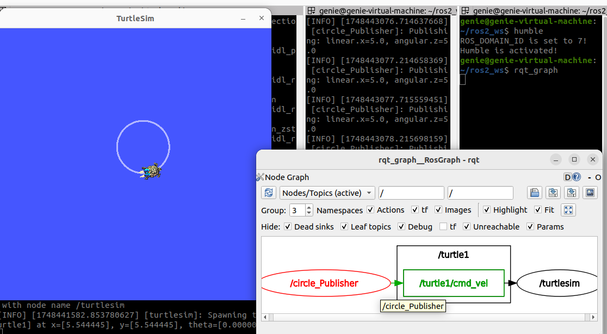

# 수행목표
퍼블리셔에 대해서 학습하고, 파이썬으로 퍼블리셔를 만들어본다.

## 1. ROS2의 노드 간에 퍼블리쉬, 서브스크라이브 관계에 대해서 조사한다.
 - **Publisher**
     - **특정 토픽에 데이터를 발행하는 노드로 센서 데이터나 명령 정보를 주기적으로 발행**한다.
 - **subscriber**
     - Publisher가 **발행한 데이터를 구독하는 노드**이다.

## 2. 이전 문제에서 turtlesim_node노드와 turtle_teleop_key 노드 간의 통신 구조를 게시와 구독의 개념으로 정리해보자.
 - **turtle_teleop_key**
     - 키보드의 입력을 받아 **속도 명령을 발행(Publisher)**한다.
 - **turtlesim_node**
     - turtle_teleop_key의 **속도 명령을 구독(subscriber)**하여 거북이를 움직인다.
 - 통신 구조
    - **두 노드는 /turtle1/cmd_vel 토픽을 중심으로 속도 명령만 전달되어 단반향 통신을 한다.**

## 3. turtlesim_node와 turtle_teleop_key 두 노드 사이의 토픽의 유형을 확인해보자. 이 유형의 통신을 구성하는 개별 값들은 각각 어떤 의미를 지니는가?
 - **토픽 리스트 확인**
     - **ros2 topic list -t**
 - **두 노드는 /turtle1/cmd_vel 토픽을 통해 통신하며, 이 토픽의 메시지유형은 geometry_msgs/msg/Twist**이다.
 - **geometry_msgs/msg/Twist**
     - **Twist는 로봇의 선속도(linear velocity) 와 각속도(angular velocity) 를 표현하기 위해 사용되는 기본 메시지 타입**이다.
     - linear:
     -   x: 0.0  # 앞으로 나아가는 속도이다. (전진/후진)
     -   y: 0.0  # 옆으로 움직이는 속도 (거북이는 X)
     -   z: 0.0  # 위/아래로 움직이는 속도 (거북이는 X)
     - angular:
     -   x: 0.0  # x축 회전 (거북이는 X)
     -   y: 0.0  # y축 회전 (거북이는 X)
     -   z: 2.0  # 회전 방향 (좌/우 회전 속도)

## 4. 파이썬으로 ROS2 퍼블리셔를 만드는 방법을 조사한다.
1. **ROS2 Python 패키지를 생성**
     - ros2 pkg create --build-type ament_python (패키지 이름)
2. **퍼블리셔 노드 코드 작성**
     - publisher_node.py 파일을 만들고 내용 작성
3. **setup.py 설정**
     - 패키지 루트 디렉터리의 setup.py 파일에 실행 파일을 등록
4. **워크스페이스에서 빌드 및 실행**   

## 5. 다음과 같이 동작하는 노드를 파이썬 프로그래밍으로 작성한다. 파이썬 프로그램 파일의 이름은 circle_turtle.py로 한다.
1. turtlesim 패키지의 turtlesim_node 노드가 실행 중일 때, 새로 만든 노드를 실행하면 로봇은 적당한 크기의 원을 그리며 계속 움직인다.
2. 이를 위해서 turtle_teleop_key가 turtlesim_node에 명령을 전달할 때 사용한 이름의 토픽에 이 토픽에 적합한 유형의 메시지를 전달해 로봇이 원을 그리며 동작할 수 있도록 메시지를 게시한다.
3. 이 토픽에 대응되는 유형은 파이썬에서 geometry_msgs.msg 모듈의 Twist 클래스이다. 이클래스를 사용해 메시지를 생성하고 turtlesim_node에 전달하면 된다.
4. Twist 클래스의 여러 속성의 값을 바꾸어가면서 각각의 속성이 어떤 의미를 지니는지도 확인한다.
5. 메시지는 원이 부드럽게 그려지도록 적당한 속도를 지정해 생성하며, 추가한 노드의 타이머도 적당한 간격으로 실행하도록 생성한다.

## 6. package.xml 파일에 다음 두 개의 의존성을 추가한다.
1. geometry_msgs와 turtlesim
2. 의존성을 추가한다는 말의 의미와, 위의 두 의존성을 추가하는 이유를 확인한다.

 - **의존성 추가란 내 ROS2 패키지가 다른 패키지에 기능을 의존하고 있다는 것을 명시하는 것 이다.**
 - **ROS2에서는 이 정보를 package.xml과 setup.py에 명시해야 빌드 도구(colcon)이 잘 작동한다.**
     - **geometry_msgs 패키지 안의 Twist 메시지를 사용하면 → geometry_msgs가 필요하고,**
     - **turtlesim 노드와 통신하거나 실행하려면 → turtlesim이 필요하다.**
     - 따라서 이런 외부 패키지들이 필요하다는 것을 선언해야 ROS가 제대로 동작한다.

## 7. 추가한 노드를 setup.py의 entry_points에 추가한 후, 빌드하고 시스템에 적용한다. 이어 동작 결과를 확인한다.
### 7-1. setup.py
 - **setup.py는 ROS2의 Python 패키지 설정 파일이다.**
 - **ament_python 빌드 시스템을 사용할 때, 이 파일을 통해 패키지 정보를 등록하고, 어떤 Python 파일을 실행할 수 있게 할지 명시한다.**
### 7-2. entry_points 란?
 - **entry_points는 실행 가능한 노드를 등록하는 곳이다.**
 - **여기에 등록하면 ros2 run 명령어로 바로 실행할 수 있게 된다.**
 - 'circle_turtle = my_robot_controller.8_circle_turtle:main',
 - ros2 run my_robot_controller circle_turtle 을 실행하면 Python코드에 의해 거북이가 계속 돈다.

## 8. rqt_graph를 사용해 노드와 토픽 정보가 포함된 그래프를 확인한 후, 이를 이미지로 저장한다.

 - **/circle_Publisher 노드는 /turtle1/cmd_vel 토픽을 발행하고, turtlesim_node는 해당 토픽을 구독하여, 메시지 내용(Twist)을 기반으로 거북이를 움직인다.**

## 9. 조사, 정리한 내용을 형식 문서로 작성해 저장한 이미지, 워크스페이스 디렉토리의 src 디렉토리의 압축 파일과 함께 게시한다.
- **src 디렉토리 압축 및 이동**
     - cd ~/ros2_ws
     - zip -r src.zip src/
     - mv src.zip ~/github_test/2/08/
