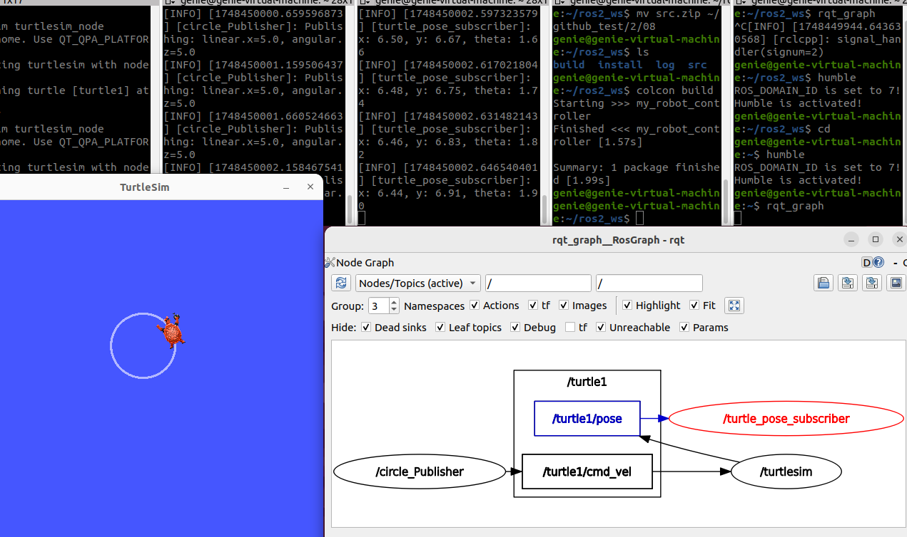

# 수행목표
서브스크라이버에 대해서 알아보고, 파이썬으로 서브스크라이버를 만들어본다.

# ROS2의 Subscriber에 대해 학습한다.
## 1. 파이썬으로 ROS2의 서브스크라이버를 만드는 방법을 조사한다.
1. **ROS2 Python 패키지를 생성**
     - ros2 pkg create --build-type ament_python (패키지 이름)
2. **서브스크라이버 노드 코드 작성**
     - subscriber_node.py 파일을 만들고 내용 작성
3. **setup.py 설정**
     - 패키지 루트 디렉터리의 setup.py 파일에 실행 파일을 등록
4. **워크스페이스에서 빌드 및 실행**
     - 워크스페이스에서 빌드 및 source 명령어로 적용

## 2. turtlesim_node를 실행한 후 토픽의 목록을 출력한다.
### 2-1. topic 확인
     - **ros2 topic list**
 - **ros2 topic list명령어 뒤에 -t를 하면 topic이름 뒤에 데이터 타입을 확인할 수 있다.**
     - ros2 topic list -t
 - **ros2 topic list명령어 뒤에 -v를 하면 발행되는 topic의 이름과 데이터 타입, 구독하는 topic의 이름과 데이터 타입을 확인할 수 있다.**
     - ros2 topic list -v
### 2-2. topic 목록
 - /parameter_events  # ROS2 시스템 기본 토픽
 - /rosout  # ROS2 시스템 기본 토픽
 - /turtle1/cmd_vel  # 거북이에게 속도를 명령하는 토픽 (Publish용)
 - /turtle1/color_sensor  # 거북이가 있는 배경색 정보
 - /turtle1/pose  # 거북이의 실시간 위치(x, y), 각도(theta) 등을 다른 노드에 전달하기 위한 정보

## 3. 출력된 토픽의 목록 중 /turtle1/pose 토픽은 turtlesim의 현재의 상황에 대한 정보를 turtlesim이 퍼블리시하는 토픽이다. 이 토픽에 대해서 조사해보자.
### 3-1. /turtle1/pose 토픽의 메시지 유형 확인
 - **ros2 topic list -t**
     - /turtle1/pose [turtlesim/msg/Pose]
 - **ros2 topic type /turtle1/pose** 
     - turtlesim/msg/Pose
 - **/turtle1/pose 토픽은 turtlesim 패키지에 정의된 Pose 메시지를 사용한다.**

### 3-2. ros2 interface show 명령에 대해서 조사한다.
 - 이 명령어는 메시지, 서비스, 액션의 구조를 보여주는 명령어이다.
 - **ros2 interface show (메시지 타입)**

### 3-3. ros2 interface show 명령으로 /turtle1/pose 토픽의 메시지 유형의 구성을 확인한다.
 - **ros2 interface show turtlesim/msg/Pose**
     - float32 x  # 거북이의 x좌표
     - float32 y  # 거북이의 y좌표
     - float32 theta  # 거북이의 방향 (라디안 단위 각도)
     - float32 linear_velocity  # 직선 속도
     - float32 angular_velocity  # 각속도 (회전 속도)

## 4. /turtle1/pose 토픽의 서브스크라이버를 turtle_pose.py 파일에 파이썬으로 구현한다.
1. 이 토픽의 메시지 유형은 turtlesim.msg 모듈의 Pose 클래스를 사용해 생성한다.
2. 서브스크라이버를 생성할 때 `turtlesim_node`가 게시하는 토픽과 동일한 이름을 사용해야 한다.
3. 서브스크라이버의 콜백함수는 구독한 메시지 중 속도를 제외한 나머지 정보의 값이 바뀔 때마다 이를 로그에 기록한다.
4. 사용자가 CTRL+C 키로 종료할 때 까지 계속해 구독한다.

## 5. 추가한 노드를 setup.py의 entry_points에 추가한 후, 빌드하고 시스템에 적용한다. 이어 동작 결과를 확인한다.
1. 이전 문제의 circle_turtle.py 파일도 함께 실행할 수 있는 형태로 작성한다.

## 6. 이전 문제에서 작성한 turtlesim이 원을 그리도록 토픽을 게시하는 퍼블리셔와 함께 실행한 상황에서 rqt_graph를 사용해 노드 및 토픽 구조 그래프 이미지를 확인하고, 이미지를 저장한다.

 - **/circle_publisher(퍼블리셔 노드)--> /turtle1/cmd_vel(속도 명령 토픽)--> turtlesim_node(거북이 이동)**
 - **turtlesim_node--> /turtle1/pose(거북이의 현재 위치/자세를 퍼블리시하는 토픽)--> /turtle_pose_subscriber(서브스크라이버 노드)**

## 7. 조사한 내용을 형식 문서로 만들고 워크 스페이스 디렉토리를 압축해 함께 게시한다.
- **src 디렉토리 압축 및 이동**
     - cd ~/ros2_ws
     - zip -r src.zip src/
     - mv src.zip ~/파일경로
     