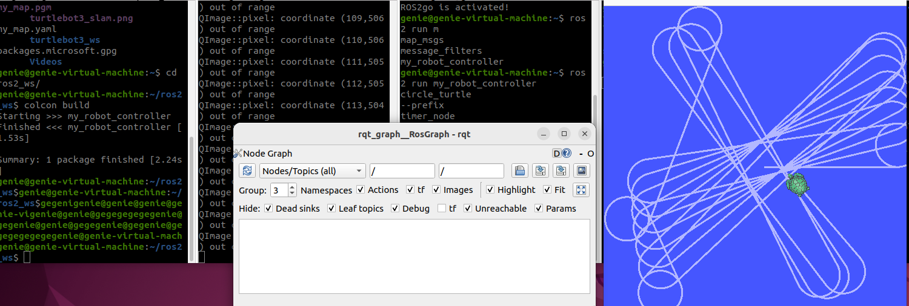
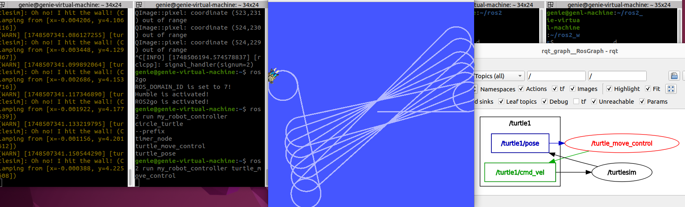

# 수행목표
게시자와 구독자를 사용해 폐쇄된 루프 시스템을 구현해 로봇을 제어한다.

# 서브스크라이버와 퍼블리셔를 동시에 같는 제어 노드를 생성 및 학습한다.
## 1. 다음과 같이 동작하는 turtlesim_node 제어 노드를 `turtle_move_control.py' 파일에 파이썬으로 작성한다.
1. 제어 노드가 시작되면 turtlesim_node의 로봇은 임의의 방향으로 직진한다.
2. 제어 노드는 turtlesim_node가 발행하는 토픽을 구독하다가 이 로봇이 벽에 충돌하지 않도록 충돌하기 전 적절한 시점에 곡선을 그리며 방향을 바꾼 후 직진한다.
3. 이 제어 노드는 서브스크라이버와 퍼블리셔를 동시에 갖는다.
4. 지정하지 않은 사항에 대해서는 자유롭게 구현한다.

## 2. 구현한 제어 노드가 동작하는데 필요한 사항을 setup.py 파일에 추가한다.
### 2-1. setup.py
 - **setup.py는 ROS2의 Python 패키지 설정 파일이다.**
 - **ament_python 빌드 시스템을 사용할 때, 이 파일을 통해 패키지 정보를 등록하고, 어떤 Python 파일을 실행할 수 있게 할지 명시한다.**
### 2-2. entry_points 란?
 - **entry_points는 실행 가능한 노드를 등록하는 곳이다.**
 - **여기에 등록하면 ros2 run 명령어로 바로 실행할 수 있게 된다.**
 - 'turtle_move_control = my_robot_controller.10_turtle_move_control:main',
 - ros2 run my_robot_controller turtle_move_control  # 실행

## 3. 제어 노드가 실행중인 상황에서 rqt_graph를 사용해 노드 및 토픽 구조 그래프 이미지를 확인하고, 이미지를 저장한다

 - **rqt_graph에 아무것도 출력안되는 문제 발생**

 

 - **source ~/ros2_ws/install/setup.bash를 거북이가 실행되는 창에도 실행해줘야 노드가 연결된다.**
 - 빌드 후 환경설정 필수

## 4. 워크 스페이스 디렉토리를 압축해 함께 게시한다.
- **src 디렉토리 압축 및 이동**
     - cd ~/ros2_ws
     - zip -r src.zip src/
     - mv src.zip ~/파일경로
