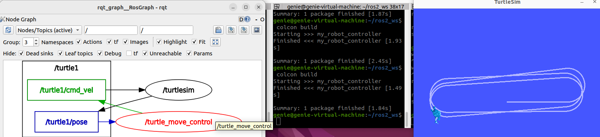

# 수행목표
ROS2의 서비스에 대해서 알아보고, 서비스 서버와 클라이언트를 파이썬으로 구현한다.

## 1. ROS2의 서비스 서버/클라이언트에 대해서 학습한다.
 - 서비스는 ROS2에서 요청(Request)을 보내면 응답(Response)을 받는 통신을 한다.
 - 서비스는 일회성이며, 지속적으로 메시지를 주고받는 토픽과 달리 요청을 보냈을 때만 응답이 온다.
 - Client node--> (Request)--> Server node
 - Servers node--> (Response)--> Client node

## 2. 터미널에서 ROS2의 노드에서 제공하는 서비스의 목록을 확인하는 방법, 서비스를 호출하는데 필요한 정보를 확인하는 방법과 서비스를 호출하는 방법을 조사한다.
### 2-1. 서비스 목록 확인
 - ros2 service list
 - ros2 service list -t  # 서비스 목록과 데이터 타입을 한번에 확인할 수 있다.
### 2-2. 서비스 데이터 타입 확인
 - ros2 service type (/서비스 이름)
### 2-3. 서비스 타입의 요청/응답 구조 확인
 - ros2 interface show (/서비스 타입)
### 2-3. 서비스 호출
 - ros2 service call (/서비스 이름) (/서비스 타입) "{타입 구조}"

## 3. demo_nodes_cpp패키지의 add_two_ints_server 노드를 실행하고, 이 노드가 제공한 서비스를 확인한 후, 명령으로 서비스를 호출해 보고, 이 과정을 별도로 기록한 후 정리한다.
### 3-1. add_two_ints_server 노드 실행
 - ros2 run demo_nodes_cpp add_two_ints_server
### 3-2. 서비스 목록 확인
 - ros2 service list  # /add_two_ints가 출력됨.
### 3-3. 서비스 데이터 타입 확인
 - ros2 service type /add_two_ints  # example_interfaces/srv/AddTwoInts가 출력됨.
### 3-4. 서비스 타입의 요청/응답 구조 확인
 - ros2 interface show example_interfaces/srv/AddTwoInts  # 서비스 타입의 구조가 출력됨.
### 3-5. 서비스 호출
 - ros2 service call /add_two_ints example_interfaces/srv/AddTwoInts "{a: 7, b: 11}"
### 3-6. 과정 정리
 - 서비스 클라이언트를 실행해서 /add_two_ints(서비스)를 호출하고, {a: 7, b: 11}값을 서버에 요청(Request)로 보낸다.
 - 서버(add_two_ints_server 노드)에서 요청(Request)를 받아서 7+11=18을 계산하고, 응답(Response)으로 클라이언트에게 보내준다.

## 4. 노드를 제어하는 과정에서 노드 제어 프로그램을 처리되지 않은 예외가 발생하지 않고, 정상적으로 종료 시키는 방법을 찾는다.
### 4-1. 예외 없이 종료하는 이유
 - ROS2에서 노드를 실행하다가 종료하는 상황(Ctrl+C, 예외 발생 등)에서는 자원을 정상적으로 해제하고, ROS 통신을 중단하며, 시스템 안정성을 유지하는 것이 중요하다.
 - ROS2 네트워크 내에서 실행 중인 노드가 갑자기 종료되면 다른 노드와의 통신이 중단되거나 충돌이 발생할 수 있다.
 - 서비스/토픽/액션 서버나 클라이언트, 타이머 등은 적절히 종료되지 않으면 메모리 누수나 포트 충돌 문제가 생길 수 있다.
### 4-2. 예외 처리
 - except KeyboardInterrupt: 사용자가 Ctrl+C를 눌렀을 때 발생하는 예외이다.
 - rclpy.shutdown(): ROS2 노드를 종료하고 내부 자원을 해제하는 함수이다.
 - finally: 예외가 발생하든 안 하든 무조건 실행되는 영역으로, 종료 처리 코드를 이 안에 넣어야 자원이 안전하게 해제된다. (destroy_node()와 rclpy.shutdown()으로 안전하게 종료)

## 5. ROS2 파이썬 프로그램에서 호출된 서비스를 처리하거나 다른 노드의 서비스를 호출하는 방법을 조사한다.
 - 서비스 서버 만들기
     - 서비스 서버는 클라이언트의 요청(Request)을 받고, 처리 후 응답(Response)을 보내는 역할을 한다.
 - 서비스 클라이언트 만들기
     - 서비스 클라이언트는 요청을 보낸 후 응답을 기다리는데, 비동기 방식(async)을 주로 사용한다.

### 5-1. 비동기 방식
 - 비동기(Asynchronous): 서비스 호출은 보통 결과가 올 때까지 기다려야 하지만, 비동기 방식으로 하면 결과를 기다리는 동안 다른 작업을 수행할 수 있다.
 - 응답 시간이 불확실하거나, 다른 센서 데이터 처리, UI 업데이트, 경로 계산 등을 동시에 하고 싶을 때 유용하다.

### 5-2. 비동기 처리 방식 (async, future)
1. call_async() 방식
 - call_async()는 비동기 요청을 보내고, 응답이 올 때까지 기다린다.
 - 반환값은 Future 객체이다.
 - Future.done()이 True일 때 결과를 확인할 수 있다.
2. Future 객체
 - 비동기 작업의 진행 상태와 결과를 나타내는 객체이다.
 - ROS2에서는 rclpy가 내부적으로 asyncio 없이 Future를 사용해 spin을 제어한다.
     - .done(): 작업이 완료됐는지 확인
     - .result(): 완료되었을 때 결과 가져오기
     - .exception(): 예외 발생 여부 확인
3. callback
 - 결과가 도착했을 때 실행되는 함수

## 6. 이전 문제의 제어 노드 프로그램에 다음과 같이 동작하는 서비스 서버와 클라이언트를 추가로 구현한다.(turtle_move_control.py)
1. turtlesim 노드는 /kill 서비스를 제공한다. 이 서비스를 호출하는 서비스 클라이언트를 추가한다.
2. 이전 프로그램에서 만든 제어 노드 프로그램에 /quit 서비스를 추가한다. /quit 서비스가 전달되면 제어 노드 프로그램이 종료하고, turtlesim의 /kill 서비스를 클라이언트를 통해 호출해 시뮬레이터 화면에 로봇을 지우고 빈 화면을 만든다.
3. /kill 서비스를 호출한 후, 서비스 호출 결과가 반환되는 동안에도 turtle_move_control 노드는 계속 하던 일을 수행해야 한다.
4. 이 과정에서 처리되지 않은 예외가 발생하지 않아야 한다.

### kill
 - turtlesim 시뮬레이터에서 거북이(turtle)를 제거하는 서비스이다.
 - Kill 서비스는 turtlesim/srv/Kill 타입이고, name이라는 필드에 제거할 거북이 이름(turtle1)을 넣으면 된다.
 - 사용하면 해당 이름을 가진 거북이가 화면에서 사라지고 더 이상 동작하지 않게 된다.
### quit
 - 사용자 정의 서비스로 작성한 코드(turtle_move_control.py)에서 새로 만든 서비스이다.
 - 타입은 std_srvs/srv/Empty이고, 호출하면 특별한 입력 없이 아래 동작을 수행한다.
     - /kill 서비스 클라이언트를 사용해서 turtle1을 제거하라고 요청하고,
     - 노드 내부의 self.keep_running = False로 설정해서 거북이의 움직임 제어를 멈춘다.

 - 즉, quit은 거북이를 종료하는 명령이고, 이 명령이 오면 프로그램은 내부에서 kill을 호출해서 거북이를 없애고, 제어도 멈춘다.

## 7. 구현한 프로그램을 실행한 후 터미널에서 /quit 서비스를 호출하고, 그 결과를 확인한다.
- 이전에 만들었던 코드에서는 ros2 service call /quit std_srvs/srv/Empty를 터미널에 입력해도 아무런 반응이없었지만 코드를 변경한 이후에는 해당 명령어로 거북이를 제거하는 것이 가능해졌다.
### quit 명령
ros2 service call /quit std_srvs/srv/Empty
### kill 명령
ros2 service call /kill turtlesim/srv/Kill

## 8. 조사한 내용을 형식 문서로 만들고 워크 스페이스 디렉토리를 압축해 함께 게시한다.
- **src 디렉토리 압축 및 이동**
     - cd ~/ros2_ws
     - zip -r src.zip src/
     - mv src.zip ~/파일경로

