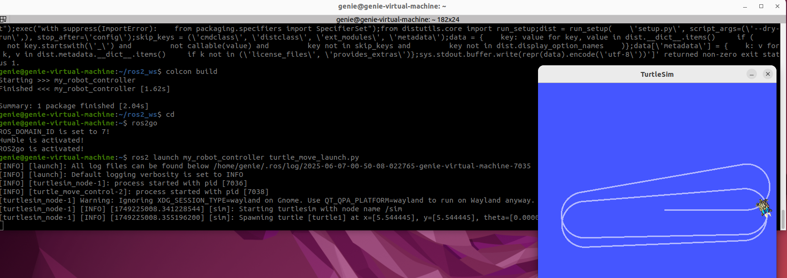

# 수행목표
ROS2의 Launch File에 대해서 학습하고, Launch File을 작성해 제어 노드를 실행

## 1. ROS2의 Launch File에 대해서 학습한다.
### 1-1. Launch File
 - **Launch File은 ROS 2에서 여러 노드들을 한꺼번에 실행하거나, 실행 시 설정(파라미터, 네임스페이스 등)을 적용하고 싶을 때 사용한다.**
 - 보통 .launch.py 확장자를 가진 파이썬 파일이다.
 - launch 파일이 설치 경로로 복사되지 않으면 ros2 launch로 실행할 수 없다.
 - ros2 run 이나 launch파일에서 실행할 노드도 setup.py에 등록되어 있어야 한다.

### 1-2. Launch File 만드는 순서
1. 먼저 **특정 패키지 안에 launch/ 폴더를 만든다.(mkdir -p launch)**
2. **launch/ 폴더안에 .launch.py 파일을 만든다.**
3. **.launch.py 파일 내용을 작성한다.**
4. **setup.py에서 launch 파일 설치 추가**
5. **빌드 및 실행**

### 1-3. 파이썬으로 Launch File을 만드는 방법에 대해서 학습한다.
```python
from launch import LaunchDescription
from launch_ros.actions import Node

def generate_launch_description():
    return LaunchDescription([
        Node(
            package='추가할_패키지명',        # 내가 만든 패키지 이름
            executable='추가할_실행파일명',   # setup.py에 등록한 실행 파일 이름
            name='노드_이름_선택사항',        # 노드 이름 (생략 가능)
            output='screen'               # 노드 출력 로그를 화면에 출력
        ),
    ])
```

### 1-4. Launch File로 패키지와 노드를 실행시키려면 setup.py에 어떤 수정이 필요한지 확인한다.
 - setup.py에는 entry_points에서 console_scripts에 노드를 등록해서 실행 가능하게 만들어야 한다.
     - 해당 과정은 노드(실행파일)를 새로 만든 경우에 진행하면된다.
     - '노드이름 = 패키지명.파일이름:main함수',를 추가하면 된다.
     - 해당 노드이름은 launch파일 내용 작성 할 때 executable에서 사용된다.

 - **data_files에는 launch 파일 경로를 추가해서 설치될 수 있도록 해줘야 한다.**
     - **('share/' + package_name + '/launch', glob('launch/*.py')),**

## 2. ros2 launch 명령어 사용법에 대해서 알아본다.
### 2-1. ros2 launch 명령어
 - **ros2 launch [패키지이름] [런치파일이름]**
 - 사용되는 옵션
     - **--show-args** : 런치 파일이 받을 수 있는 인자를 보여줌
     - **--log-level info** : 노드 로그 레벨 설정 (debug, info, warn, error)
     - **--no-daemon** : 로스 런처 백그라운드 프로세스 없이 실행
### 2-2. ros2 run과 비교
 - **ros2 run**
     - 하나의 노드 실행
     - 간단한 테스트용
     - 실행 파일 직접 지정
 - **ros2 launch**
     - 여러 노드, 매개변수
     - 실제 시스템 실행 시 자주 사용
     - launch 파일 작성 필요

## 3. 다음과 같이 동작하는 ROS2의 Launch File을 만든다.
1. turtlesim 패키지의 turtlesim_node 노드를 실행한다.
2. my_robot_controller 패키지의 turtle_move_controller 제어 노드(이전 문제에서 작성한 제어 노드)를 실행한다.
### 3-1. launch/ 폴더 만들기
 - cd ~/ros2_ws/src/my_robot_controller
 - mkdir launch
### 3-2. .launch.py 파일 만들기
 - cd launch
 - touch turtle_move_launch.py
### 3-3. Launch 파일 내용 작성
### 3-4. setup.py에서 launch 파일 설치 추가
 - from glob import glob   **# glob 함수를 쓰려면 from glob import glob 임포트가 필요하다.**
 - ('share/' + package_name + '/launch', glob('launch/*.py')),
### 3-5. 빌드 및 환경 설정 후 실행
 - cd ~/ros2_ws
 - colcon build --packages-select my_robot_controller
 - source install/setup.bash
 - ros2 launch my_robot_controller turtle_control_launch.py

## 4. ros2 launch 명령을 사용해 로봇을 한 번에 동작 시킨 후 결과를 확인해보자.



 - **원래는 ros2 run turtlesim turtlesim_node 명령어로 거북이를 실행시킨 후 만들어 놓은 10_turtle_move_controller 노드를 실행시켰지만 런치 파일을 만들어 두 노드를 각각 실행하는 명령어를 한 번에 실행할 수 있게 된 것을 확인할 수 있다.**

## 5. 조사한 내용을 형식 문서로 만들고 워크 스페이스 디렉토리를 압축해 함께 게시한다.
 - **워크 스페이스 디렉토리 압축 및 이동**
     - cd ~/ros2_ws
     - zip -r ros2_ws.zip .
     - mv ros2_ws.zip ~/파일경로/