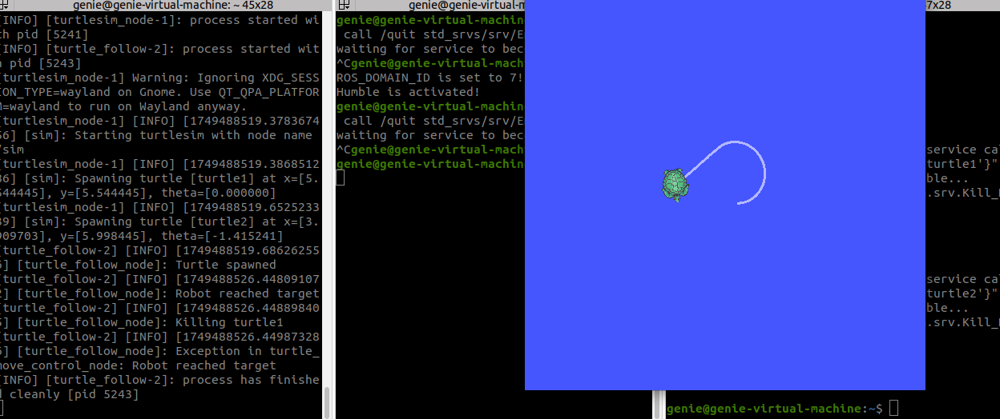
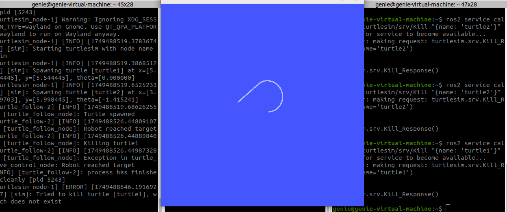

# 수행목표
ROS2 파이썬 프로그래밍 기초를 복습하는 간단한 프로젝트를 수행한다.

# 과정2 복습
## 1.turtlesim_node 노드의 \spawn 서비스를 사용하면 turtlesim_node에 거북이 로봇을 추가할 수 있다.
### 1-1. ros2 service list -t 명령어로 /spawn의 서비스 타입을 확인할 수 있다.
 - ros2 service list -t
 - /spawn [turtlesim/srv/Spawn]이 출력되는 것을 확인할 수 있다.
### 1-2. ros2 interface show 명령어로 turtlesim/srv/Spawn의 데이터 구조를 확인할 수 있다.
- ros2 interface show turtlesim/srv/Spawn
### 1-3. ros2 service call 명령어로 거북이를 여러 마리 호출할 수 있다.
- ros2 service call /spawn turtlesim/srv/Spawn "{x: 2.0, y: 2.0, theta: 0.0, name: 'turtle2'}"

## 2. 다음과 같이 동작하는 제어 프로그램을 작성한다. 프로그램은 turtle_follow.py 파일에 작성한다.
1. ros2 launch 명령어로 프로그램이 동작하면 우선 turtlesim_node와 제어 프로그램 두 개의 노드가 실행된다.
2. 제어 프로그램 노드는 \spawn 서비스를 사용해 하나의 거북이 로봇을 추가한다. 추가하는 거북이 로봇의 상태는 임의의 상태로 정하되 시뮬레이션 윈도우 내에 위치한다.
3. 먼저 생성된 거북이 로봇이 자연스러운 궤적을 그리면서 다른 거북이 로봇을 향해 이동한다.
4. 두 로봇이 만나면 이동중인 로봇을 화면에서 지운 후 프로그램을 종료한다.
5. 제어 프로그램 노드는 \quit 서비스 호출을 받는다. \quit 서비스가 호출되면 두 개의 로봇모두를 화면에서 삭제하고 프로그램을 종료한다.

 - 13_turtle_follow.py 파일 작성
 - turtle_follow_launch.py 파일 작성
 - setup.py 수정
 - 빌드 및 환경설정 및 실행

## 3. 제어 프로그램을 실행하는데 필요한 Launch File을 작성하고 setup.py나 package.xml에 필요한 사항을 추가한다.
### 3-1. Launch File 작성
```python
from launch import LaunchDescription
from launch_ros.actions import Node

def generate_launch_description():
    return LaunchDescription([
        Node(
            package='turtlesim',
            executable='turtlesim_node',
            name='sim'
        ),
        Node(
            package='my_robot_controller',
            executable='turtle_follow',
            name='turtle_follow_node',
            output='screen'
        )
    ])

```
### 3-2. setup.py 내용 추가
 - 'turtle_follow = my_robot_controller.13_turtle_follow:main',

## 4. 실행하고 결과를 확인한다.





### 4-1. turtle_follow_launch 파일 실행
 - ros2 launch my_robot_controller turtle_follow_launch.py 

### 4-2. quit 서비스 호출
 - ros2 service call /quit std_srvs/srv/Empty

### 4-1. 거북이 1, 2 제거
 - ros2 service call /kill turtlesim/srv/Kill "{name: 'turtle1'}"
 - ros2 service call /kill turtlesim/srv/Kill "{name: 'turtle2'}"

## 5. 워크 스페이스 디렉토리를 압축해 함께 게시한다.
 - **워크 스페이스 디렉토리 압축 및 이동**
     - cd ~/ros2_ws
     - zip -r ros2_ws.zip .
     - mv ros2_ws.zip ~/파일경로/