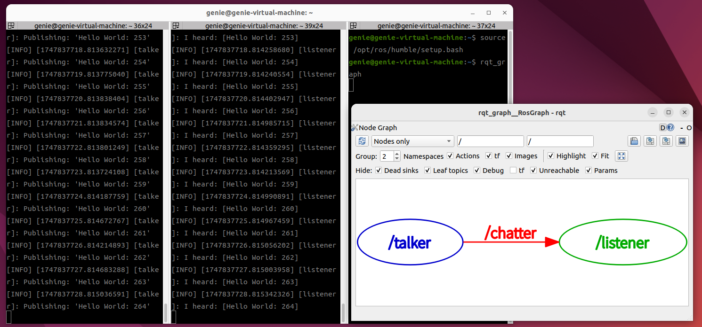
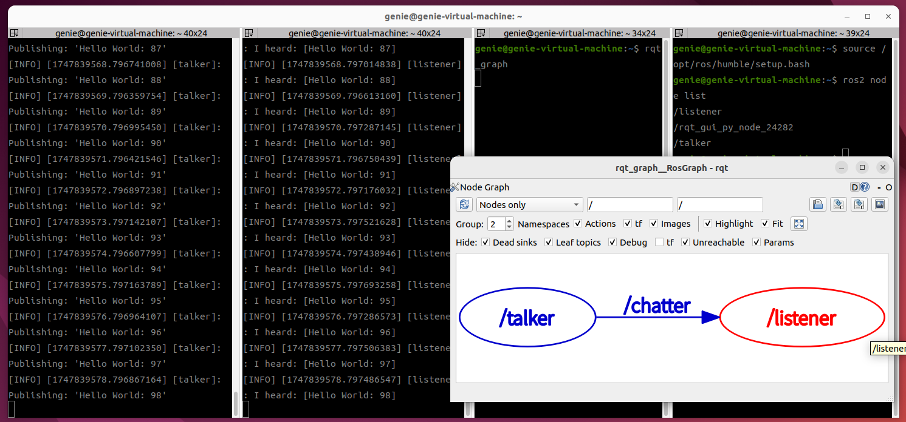
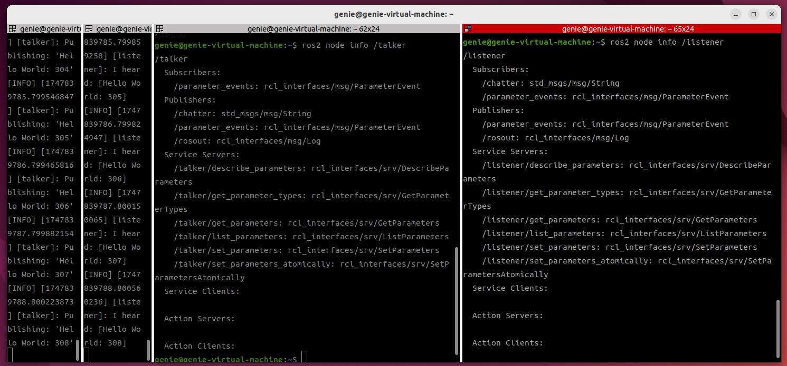
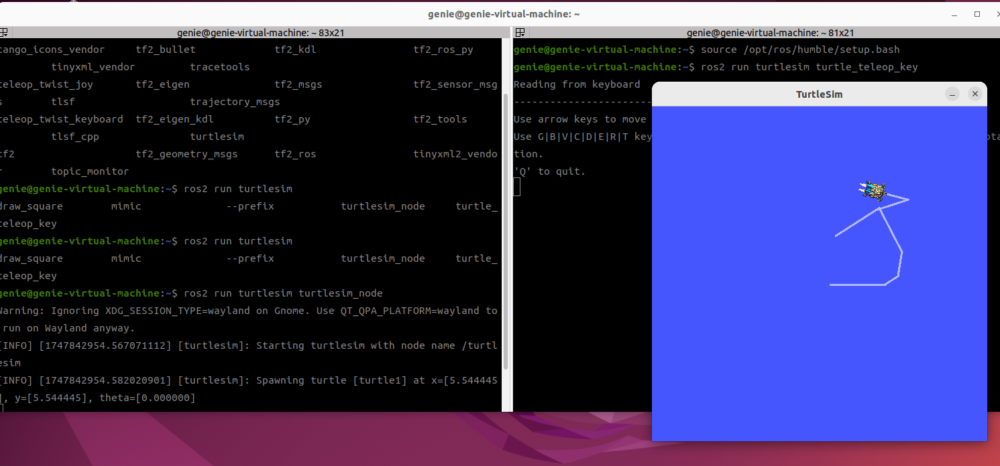

# 수행 목표
ROS2의 노드의 개념에 대해서 학습한다.

# ROS2의 노드에 대해 학습
## 1. ROS2에서 노드(node)란
- 하나의 노드는 하나의 역할을 수행하는 소프트웨어 블록이다.
- **센서 데이터 수신, 제어 명령 송신 등의 역할을 수행하며 노드는 다른 노드들과 메시지를 주고받으며 통신**한다.
- **노드는 서로 토픽(topic)을 통해 메시지를 주고 받는다.**
- 만약 로봇 청소기를 예로 들면 camera_node(카메라 센서로 부터 이미지 수신), lidar_node(라이다 센서 데이터 수집), navigation_node(경로 계획 및 이동 명령), mortor_controller_node(바퀴제어)등이 각각 하나의 노드이다.

## 2. 두 개의 데모 프로그램(demo_nodes_cpp 패키지의 talker 노드와 listener 노드)을 실행 한 후, rqt_graph 프로그램을 실행한 후, 두 노드 사이의 관계를 보여주는 화면을 캡쳐해 이미지 파일로 저장
- rqt_graph는 ROS2 humble과 함께 설치되는 도구이며, ROS2로 만든 로봇의 각 구성 요소 간의 관계를 그래프 형태로 나타내는 도구이다.
- 노드 간의 관계를 보기 위해서는 'Nodes only' 모드를 사용해야 하며, 나머지 옵션은 적당히 조정 해 보면서 두 데모 프로그램의 관계를 가장 잘 보여주는 화면을 찾으면 된다.
- 만약 가장 최근의 상황이 rqt_graph 프로그램에 나타나지 않으면 리로드 버튼을 클릭해서 화면 을 새로 고친 후 확인하면 된다.

## 3. 별개의 터미널에서 ros2 node list, ros2 node info (노드이름) 명령을 실행
 - **ros2 node는 ROS2에서 실행 중인 노드(Node)를 다루는 명령어**이다.
 - **ros2 node list**: 현재 실행 중인 모든 노드 이름을 출력
 - **ros2 node info (노드이름)**: 특정 노드의 상세 정보를 출력한다.(Publish/Subscribe,서비스 등)
### 3-1. ros2 node 명령에 대해서 알아보고 ros2 node list 명령의 결과가 rqt_graph의 그래프와 일치하는지 확인
 - **현재 실행 중인 /listener, /rqt_gui_py_node_24919, /talker가 표시되는 것을 확인할 수 있다.**

### 3-2. ros2 node info (노드이름) 명령을 사용해 두 노드의 정보를 출력
 -  **ros2 node info /talker**
     - **Subscribers(수신자)**: /parameter_events 토픽을 수신하고 있다.
     - **Publishers (발신자)**: /chatter(메시지 발생하는 토픽), /parameter_events(파라미터 관련 이벤트 정보 발행), /rosout(로그 메시지를 ROS 시스템으로 출력)
     - **Service Servers (서비스 서버)**: /talker/describe_parameters 등 (파라미터 설정, 조회, 변경 등에 관련된 기능)

 - **ros2 node info /listener**
     - **Subscribers**: /chatter 토픽을 구독, /parameter_events
     - **Publishers**: /parameter_events(파라미터 변경 사항 발행), /rosout(시스템용 로그 메시지를 발행)
     - **Service Servers**: /listener/describe_parameters 등 (ROS2 노드가 서비스 요청을 받아서 처리할 수 있는 기능)

## 4. 각각의 터미널에서 turtlesim 패키지의 turtlesim_node와 turtle_teleop_key 두 개의 노드를 각각 실행해보고, 두 노드 간 관계를 학습 및 이미지 파일 저장
 - turtle_teleop_key 노드를 실행하면, 실행할 때의 설명에 따라 키를 입력해 turtlesim_node 노드를 실행해 생성된 로봇을 움직일 수 있다.

 - **turtlesim_node 실행**
     - source /opt/ros/humble/setup.bash
     - ros2 run turtlesim turtlesim_node 

 - **turtle_teleop_key 실행**
     - source /opt/ros/humble/setup.bash
     - ros2 run turtlesim turtle_teleop_key 

