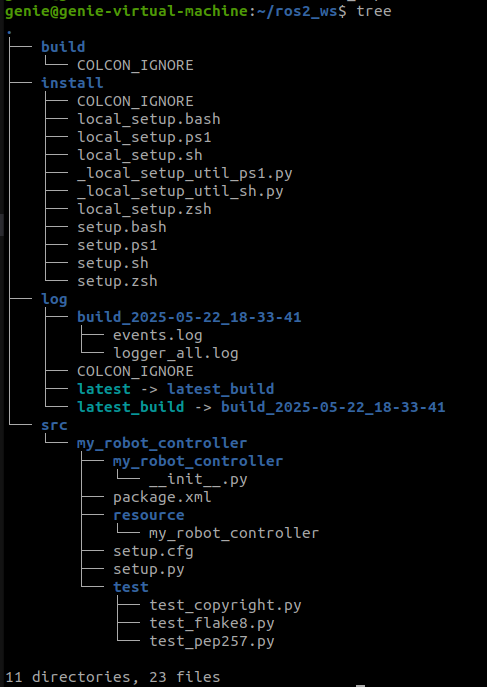

# 수행 목표
ROS2 패키지 및 파이썬 빌드 시스템에 대해 학습한다.

# 워크스페이스 디렉토리 학습
## 1. ROS2 프로그래밍을 위한 워크스페이스 디렉토리를 생성한다.
 - 이 문제 및 이어지는 문제에서 **~/ros2_ws로 표현되는 디렉토리가 워크스페이스 디렉토리임**을 숙지한다.
 - mkdir ros2_ws  # 워크스페이스 디렉토리 생성

## 2. 워크스페이스 디렉토리 아래에 src 디렉토리를 생성한다. (~/ros2_ws/src)
 - 이 디렉토리는 앞으로 **src 디렉토리 또는 소스 디렉토리**라고 부른다.
 - mkdir ros2_ws/src  # 워크스페이스 디렉토리 아래에 src 디렉토리 생성

## 3. ROS2의 colcon 명령어에 대해서 조사한다.
 - **colcon build는 src 디렉토리에 존재하는 패키지를 빌드한다.**
 - **colcon은 ROS2의 공식 빌드 도구**이다.
 - 여러 패키지를 동시에 빌드한다.
 - colcon 명령어
     - **colcon build**: 워크스페이스 내 모든 패키지를 빌드한다.
     - **colcon build --packages-select (pkg)**: 특정 패키지만 선택적으로 빌드한다.
     - **colcon build --packages-up-to (pkg)**: 지정한 패키지와 그 의존성 패키지를 모두 빌드한다.
     - **colcon list**:	워크스페이스 내 패키지를 나열한다.
     - **colcon clean**: 빌드, 설치, 로그 디렉토리를 삭제한다.
     - **colcon graph**: 의존성 그래프를 출력한다. (dot 사용)

## 4. 워크스페이스 디렉토리에서 colcon build 명령으로 빈 패키지를 생성한다.
 - 만약 colcon 명령어가 없다는 오류가 발생하면, ROS2 환경 설정을 위해서 수행했던 과정을 다시 확인해 본다.

 - **colcon 설치**
    - sudo apt update
    - sudo apt install python3-colcon-common-extensions
    - colcon --version  # colcon이 설치된 것을 확인할 수 있다.

 - **colcon build 로 패키지를 빌드**
    - source /opt/ros/humble/setup.bash  # ROS2 환경 실행
    - cd ros2_ws  # 워크스페이스로 이동
    - colcon build  # 빈 패키지 생성
    - ls  # build  install  log가 생성된 것을 확인할 수 있다.

## 5. 소스 디렉토리에서 my_robot_controller라는 이름의 패키지를 생성한다.
### 5-1. ROS2로 제어 노드 프로그램을 만들 때 여러 종류의 빌드 시스템을 사용할 수 있다.이 중 Python을 활용해 제어 노드 프로그램을 만드는데 사용하는 빌드 시스템에 대해서 조사한다.
 - **ament_python**
     - **ROS2에서 Python 패키지를 빌드하기 위해 사용하는 표준 빌드 시스템**이다.
     - **ament_python은 Python 기반 패키지에서 setup.py를 통해 설치/빌드되며, ROS2와 연동된다.**
 - **ament_python 빌드 시스템은 package.xml, setup.py, setup.cfg의 정보를 바탕으로 ROS2 패키지를 설치하고 실행할 수 있도록 구성한다.**
 - Python 노드를 실행할 수 있는 형태로 설치된다.
 - Python으로 작성한 ROS2 노드를 배포하거나 실행할 때 사용됩니다.

### 5-2. 패키지를 생성하는 명령은 ros2 pkg create 명령이다. 이 명령의 사용법에 대해서 알아보자.
 - **ros2 pkg create (패키지이름)**

 - 주요 옵션 정리
     - **--build-type (타입)**:	빌드 시스템 지정 (ament_cmake, ament_python)
     - **--dependencies (패키지명)**: 의존하는 ROS2 패키지를 명시
     - **--license (라이선스)**: 패키지 라이선스를 명시
     - **--node-name (노드명)**: 기본 노드 이름 설정 (선택 사항)
     - **--description (설명)**: 패키지 설명 작성 (선택 사항)

 - 사용 예: ros2 pkg create my_python_node --build-type ament_python --dependencies rclpy

### 5-3. 패키지를 생성할 때 ament_python 빌드 시스템을 옵션으로 지정하고, rclpy 파이썬 패키지 의존성도 옵션으로 추가한다.
 - cd ~/ros2_ws/src
 - ros2 pkg create my_robot_controller --build-type ament_python --dependencies rclpy

 - 위 명령어는 다음을 수행한다.
     - **my_robot_controller**: 디렉토리를 생성
     - **package.xml, setup.py, setup.cfg** 파일 생성
     - **--build-type ament_python**: Python 빌드 시스템(ament_python) 적용
     - **--dependencies rclpy**: ROS2의 Python 클라이언트 라이브러리인 rclpy를 의존성으로 등록

### 5-4. rclpy가 무엇이며 어떤 용도로 사용되는 파이썬 패키지인지를 조사해보자.
 - rclpy는 ROS2의 Python용 클라이언트 라이브러리이다.
 - rclcpp는 C++용, rclpy는 Python용이라고 생각하면 된다.
 - 주요 기능
     - **Node 클래스**: ROS2 노드 생성
     - **Publisher**: 토픽 발행 기능
     - **Subscription**: 토픽 수신 기능
     - **Timer**: 주기적인 작업 수행
     - **Service, Client**: 서비스/클라이언트 처리

## 6. apt 또는 apt-get 명령을 사용해 tree 프로그램을 설치한 후, 워크스페이스 및 패키지를 생성한 후의 워크스페이스 디렉토리에서 tree 프로그램을 실행해보자. 실행 결과는 조사 문서에 기록한다.
 - **tree 명령어 설치**
     - sudo apt update
     - sudo apt install tree
     - tree --version  # tree가 설치된 것을 확인할 수 있다.
 - **tree 명령어 실행**
     - cd ~/ros2_ws
     - tree

 - **실행 결과 요약**
     - src/ 디렉토리 안에 my_robot_controller라는 Python 패키지가 생성되어있다.

 - 해당 패키지 안에는 다음과 같은 구성 요소가 포함되어있다.
     - **my_robot_controller/**: 실제 코드가 들어갈 Python 모듈 디렉토리
     - **package.xml**: 의존성, 라이선스, 메타데이터 작성
     - **resource/**: 패키지 리소스 파일
         - **setup.py, setup.cfg**: Python 설치 정보
     - **test/**: 테스트 코드 작성 디렉토리

## 7. 패키지를 만들면 여러 디렉토리와 여러 파일이 만들어진다. 그 중 구조 및 사용법을 숙지해야 하는 가장 중요한 두 개의 파일은 package.xml과 setup.py 파일이다. ROS2 패키지에서 두 개의 파이썬이 각각 어떤 역할을 하며, 어떤 구조로 구성되어 있는지를 조사해보자.
### 7-1. package.xml
 - **ROS2 생태계에서 패키지를 정의**하는 메타데이터 파일이다.
 - ROS2 도구 (colcon build, rosdep, ros2 run 등)에서 패키지를 인식하고 처리하기 위한 핵심 정보 제공
 - **의존성 관리, 라이선스 정보, 작성자 정보 등을 정의**한다.
 - **주요 태그 설명**
     - **(name)**: 패키지 이름
     - **(version)**: 버전
     - **(description)**: 설명
     - **(maintainer)**: 유지보수자 정보
     - **(license)**: 라이선스
     - **(exec_depend)**: 실행 시 필요한 ROS2 패키지
     - **(buildtool_depend)**: 빌드 툴 (예: ament_cmake 또는 ament_python)

### 7-2. setup.py
 - **Python 생태계에서 패키지를 설치/배포하기 위한 설정 파일**이다.
 - ROS2에서는 ament_python 빌드 시스템이 setup.py를 이용해 패키지를 설치하고 실행 가능하게 설정한다.
 - entry_points를 통해 ros2 run 명령어로 실행할 수 있는 노드를 등록할 수 있다.
 - 주요 항목 설명
     - **name, version**: 패키지 이름과 버전
     - **packages**: 설치할 Python 모듈 이름 (보통 패키지 이름과 동일)
     - **data_files**: ROS2와 연동을 위해 package.xml 경로 지정
     - **install_requires**: 설치 시 필요한 Python 패키지 (ex. setuptools)
     - **entry_points**: ROS2 run으로 실행 가능한 노드 정의 (ros2 run my_robot_controller controller_node)

워크스페이스 및 패키지를 생성한 후의 워크스페이스 디렉토리에서 tree 프로그램을 실행해보자. 실행 결과는 조사 문서에 기록한다.
cd ros2_ws/
tree > ~/github_test/2/4/ros2_ws_tree.txt

워크 스페이스 디렉토리에서 src 디렉토리를 압축해 함께 게시한다.
워크스페이스 디렉토리를 압축 한 파일도 함께 게시한다.

cd ~/ros2_ws  # 워크스페이스로 이동
zip -r src.zip src/  # src.zip파일이 생성된다.
mv src.zip ~/github_test/2/4/  # 압축된 src.zip파일을 github_test/2/4/로 이동한다.

