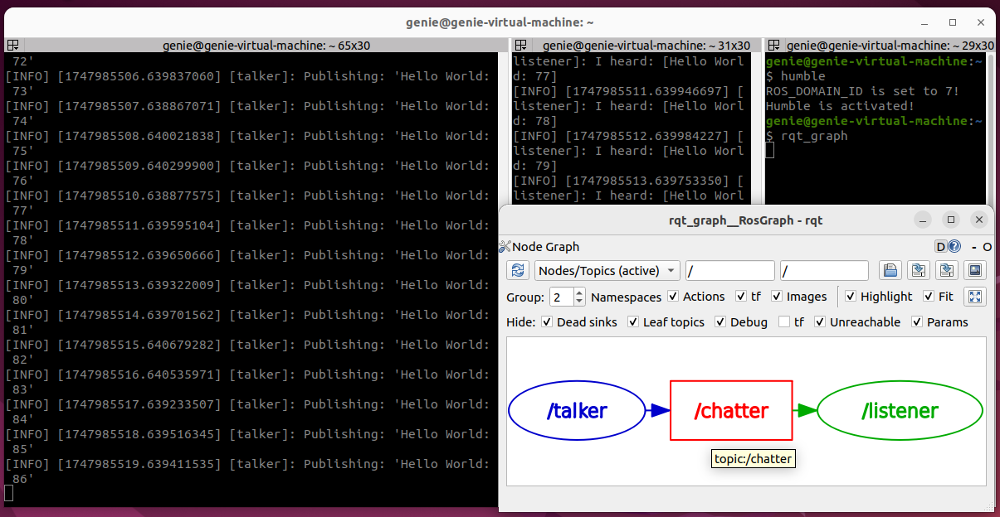
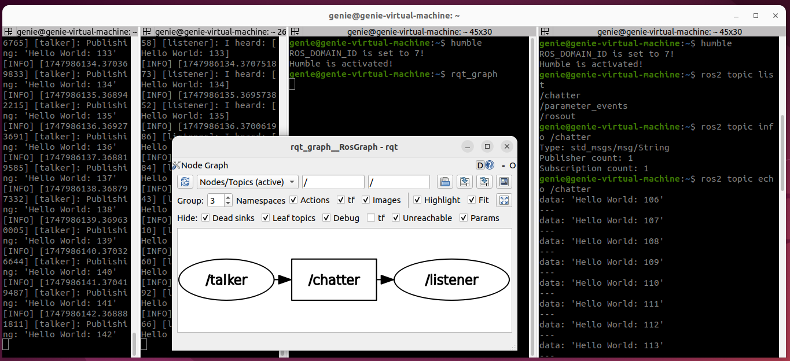
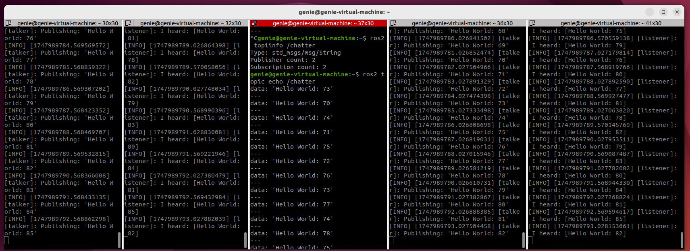
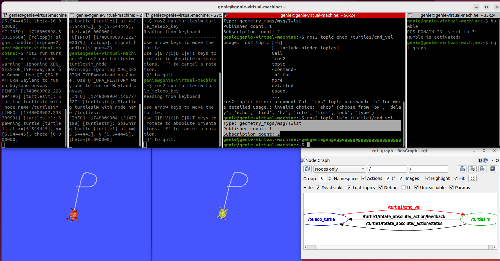

# 수행 목표
ROS2의 토픽에 대해 학습한다.

# ROS2의 토픽에 대해 학습한다.
## 1. demo_nodes_cpp 패키지의 talker와 listener 노드를 실행한 상태에서 rqt_graph를 실행한다.
 1. 모드를 Nodes only 대신 Nodes/Topics (active)로 바꾸고 그래프를 확인해보자.
 2. 그래프에서 그래프의 연결선의 방향성도 확인해보자.
 3. rqt_graph에서 출력되는 그래프를 이미지로 저장한다.

 - humble  # ros2 환경 실행 (source /opt/ros/humble/setup.bash)
 - ros2 run demo_nodes_cpp talker
 - ros2 run demo_nodes_cpp listener  # 새 터미널에서 ros2 환경 부르고 실행
 - rqt_graph  # 새 터미널에서 ros2 환경 부르고 실행
 - **talker는 /chatter 토픽을 발행(publish)하고, listener는 /chatter 토픽을 구독(subscribe)**하는 것을 확인할 수 있다.

## 2. 두 개의 노드가 실행중인 상황에서 다음 세 개의 명령을 다른 터미널에서 실행해 보고, 실행 결과는 문서에 수록한다.
1. ros2 topic list
2. ros2 topic info /chatter
3. ros2 topic echo /chatter
4. ros2 topic 명령의 사용법 및 위 세 명령이 의미하는 바를 확인한다.

### 2-1. ros2 topic list
 - **현재 활성화된 모든 토픽 목록을 출력한다.**
     - **/chatter**: talker가 발행하는 토픽
     - **/parameter_events**: ROS2 시스템 내부 파라미터 이벤트
     - **/rosout**: 로그 출력을 위한 시스템 토픽
### 2-2. ros2 topic info /chatter
 - **지정한 토픽에 대한 정보(Type, Publisher, Subscription count)를 출력한다.**
     - **Type: std_msgs/msg/String**: /chatter는 std_msgs/msg/String(문자열) 타입을 사용
     - **Publisher count: 1**: Publisher: talker 노드 1개
     - **Subscription count: 1**:Subscriber: listener 노드 1개
### 2-3. ros2 topic echo /chatter
 - **/chatter 토픽으로 전송되는 실제 메시지를 실시간으로 출력한다.**
     - **data: 'Hello World: 106'**: talker가 1초 간격으로 (Hello World: N)의 문자열 메시지를 발행하는 것을 확인할 수 있다.

## 3. ROS2의 기본 메시지 유형에 대해서 학습한다.
1. **ros2 interface list** 명령을 통해서 설치된 메시지 타입을 확인할 수 있다.
 - ros2 interface list | grep msg
2. **ros2 interface show** 명령을 통해서 특정 메시지의 정의를 확인할 수 있다.
 - ros2 interface show nav_msgs/msg/MapMetaData

### 3-1. std_msgs
 - **ROS2에서 가장 기본적인 메시지 타입들을 제공한다.**
     - **std_msgs/msg/Bool**: true 또는 false 값
     - **std_msgs/msg/Int32**: 32비트 정수
     - **std_msgs/msg/Float64**: 64비트 부동소수점 숫자
     - **std_msgs/msg/String**: 문자열 메시지
     - **std_msgs/msg/Header**: 타임스탬프 + 프레임 ID (센서 메시지에 자주 사용)
### 3-2. geometry_msgs (기하학적 메시지)
 - **위치, 속도, 방향 등 로봇의 동작과 관련된 메시지**
     - **geometry_msgs/msg/Point**: x, y, z 좌표
     - **geometry_msgs/msg/Quaternion**: 방향 (회전 정보, 사원수)
     - **geometry_msgs/msg/Pose**: 위치 + 방향 (Point + Quaternion)
     - **geometry_msgs/msg/Twist**: 선속도 + 각속도
     - **geometry_msgs/msg/Vector3**: 벡터값 (x, y, z)
### 3-3. sensor_msgs (센서 관련 메시지)
 - **센서로부터 들어오는 다양한 데이터를 표현**
     - **sensor_msgs/msg/Image**: 이미지 데이터
     - **sensor_msgs/msg/LaserScan**: 라이다 데이터 (1D 스캔)
     - **sensor_msgs/msg/Imu**: IMU 센서 데이터
     - **sensor_msgs/msg/PointCloud2**: 포인트 클라우드 (3D 센서)
     - **sensor_msgs/msg/Range**: 초음파, 적외선 거리 센서 등
     - **sensor_msgs/msg/BatteryState**: 배터리 상태 정보
### 3-4. nav_msgs (내비게이션 관련)
 - **경로 계획, SLAM, 지도 등에서 사용**
     - **nav_msgs/msg/Odometry**: 위치, 속도 정보
     - **nav_msgs/msg/Path**: 로봇이 따라야 할 경로
     - **nav_msgs/msg/OccupancyGrid**: 지도 (2D Grid 형태)
     - **nav_msgs/msg/MapMetaData**: 지도에 대한 메타 정보

## 4. 토픽은 단순히 두 노드 사이의 통신을 의미하는 것이 아니다. 이를 확인하기 위해서 터미널을 두 개 더 실행하고, 다음 상황에서 ros2 topic info /chatter 명령을 실행해보자.
1. talker 노드가 한 개, listener 노드가 두 개 실행된 상황
2. talker 노드가 두 개, listener 노드가 한 개 실행된 상황
3. talker 노드가 두 개, listener 노드가 두 개 실행된 상황
4. 각 상황에서 게시자(Publisher)와 구독자(Subscription)의 수가 어떻게 변화하는지 확인하고, 의미하는 바에 대해서 학습한다.

 - 두 publisher가 동일한 /chatter 토픽에 메시지를 발행한다.
 - 두 listener는 모두 이 토픽을 구독하여, 두 곳에서 온 메시지를 모두 수신 가능하다.
 - **ROS 2의 토픽은 "1:1 통신"이 아니라, 브로드캐스트 방식과 유사한 N:N 통신 구조**임을 알 수 있다.
 - 이로 인해 유연한 시스템 구성이 가능하다. **(로봇, 센서, 모터 등 자유롭게 붙이고 떼기 쉬움)**
 - 하지만 **다수 Publisher가 있을 경우 동기화, 메시지 충돌, 타이밍 이슈에 주의**가 필요하다.

## 5. turtlesim 패키지의 turtlesim_node 노드 두 개와 turtle_teleop_key 노드 하나를 실행하고 다음 사항을 확인한다.
## 6. 키보드로 로봇을 움직이게 했을 때 두 개의 turtlesim_node에서 어떤 일이 벌어지는지 확인하고, 이 때의 두 turtlesim_node의 실행 화면 이미지도 저장한다.
1. 이 상황에서 세 노드 사이의 토픽(/turtle1/cmd_vel)의 정보를 확인하고, 확인한 결과와 함께 다음 사항을 확인해 정리한다.
    - 게시자와 구독자의 수
    - 토픽 형태의 정보
    - 토픽의 내용 캡쳐
2. 지금까지 확인한 바를 바탕으로 세 개의 노드 사이에 벌어지고 있는 일에 대해서 정리한다.

 - ros2 run turtlesim turtlesim_node  # ros2 환경을 실행하고 거북이1 생성
 - ros2 run turtlesim turtlesim_node  # 새 터미널에서 ros2 환경을 실행하고 거북이2 생성
 - ros2 run turtlesim turtle_teleop_key
 - **ros2 topic list**
     - **현재 활성화된 모든 토픽 목록을 출력**
     - /parameter_events
     - /rosout
     - **/turtle1/cmd_vel**
     - /turtle1/color_sensor
     - /turtle1/pose
 - **ros2 topic info /turtle1/cmd_vel**
     - **지정한 토픽에 대한 정보(Type, Publisher, Subscription count)를 출력**
     - Type: geometry_msgs/msg/Twist  # 선속도 + 각속도값을 얻을 수 있다.
     - Publisher count: 1  # **turtle_teleop_key 하나에서 발행**하는 것을 알 수 있다.
     - Subscription count: 2  # **두개의 turtlesim_node에서 구독**하는 것을 알 수 있다.
 - **ros2 topic echo /turtle1/cmd_vel**
     - **/turtle1/cmd_vel 토픽으로 전송되는 실제 메시지를 실시간으로 출력한다.**
     - linear:
     -   x: 0.0
     -   y: 0.0
     -   z: 0.0
     - angular:
     -   x: 0.0
     -   y: 0.0
     -   z: 2.0

 - 두 개의 turtlesim_node가 동일한 /turtle1/cmd_vel토픽을 구독하게 되어 키보드 입력 하나에 두 노드가 모두 반응하게 된다.
 
