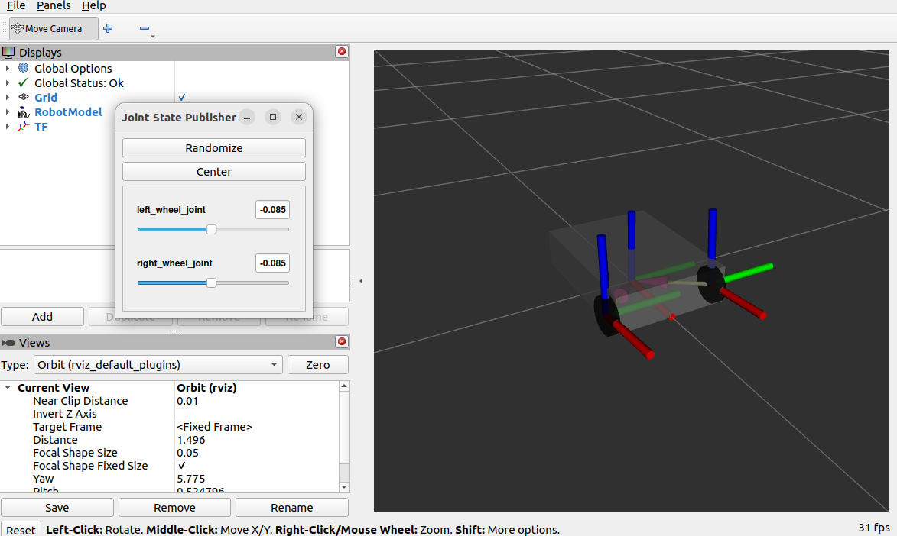

# 수행목표
간단한 구조의 로봇 모델을 만들어본다.

## 1. URDF 파일이 무엇이며, 어떤 구조를 가진 파일인지를 조사한다.
 - URDF(Unified Robot Description Format)는 로봇의 물리적 구조와 관계를 XML형식으로 기술한 파일이다.
 - ROS(Robot Operating System)에서 로봇을 시각화하거나 시뮬레이션할 때, URDF는 로봇의 구성요소를 정의하는 핵심 파일이다.
 - 링크(Link)
     - 로봇을 구성하는 고정된 물체를 말한다.. (몸체, 팔, 바퀴 등)
     - 각각의 링크는 시각 정보(visual), 충돌 정보(collision), 질량(inertial) 등을 가질 수 있다.
 - 조인트(joint)
     - 링크와 링크를 연결해 움직이게 하는 관절을 말한다. (회전 관절, 직선 이동 관절, 고정된 연결)
     - fixed: 고정되어 있어 움직임 없음
     - revolute: 일정 범위에서 회전 가능
     - continuous: 제한 없는 회전 (예: 바퀴)
     - prismatic: 직선 이동 (예: 슬라이더)
     - floating: 6자유도 운동 (드론 등)
     - planar: 2D 평면 이동

 - 링크, 조인트 외에 URDF파일 주요 정보
     - 관절의 종류: 고정, 회전, 직선운동 등
     - 모양(geometry): 시각화와 충돌 검출용 (박스, 원기둥, 메시 등)
     - 위치(origin): 링크/조인트의 상대 위치와 방향 (xyz, rpy(roll=앞뒤, pitch=위아래, yaw=좌우))

## 2. 박스형 몸통에 두 개의 바퀴를 가진 간단한 로봇을 URDF 파일 형식으로 만들어본다.
1. 지정하지 않은 나머지 로봇의 특징은 자유롭게 구성한다. 단, 이 로봇의 바퀴는 로봇이 움직일 수 있는 형태로 연결되어야 한다.
 - 패키지 안에 urdf라는 디렉토리를 만들고 그 안에 simple_wheel_robot.urdf파일을 만들어 URDF코드를 작성한다.

## 3. xacro 파일에 대해서도 용도와 구조에 대해서 조사한다.
### 3-1. xacro 파일의 용도
- xacro는 복잡한 URDF 파일을 간결하게 만들어 준다.
     - 반복되는 구조 정의: 동일한 링크, 조인트 구조를 반복적으로 사용하는 경우 유용하다.(예: 다관절 로봇의 팔, 다리)
     - 매개변수화: 링크 길이, 질량, 색상 등을 매개변수로 정의하고 쉽게 변경이 가능하다.
     - 조건문 및 반복문 사용: if, unless, for 같은 논리 구조 사용이 가능하다.(일반 URDF에서는 불가능)
     - 모듈화: 여러 파일로 나누어 작성하고 조립이 가능하다. (<xacro:include>)

### 3-2. xacro 파일의 구조
 - .xacro 파일은 URDF와 비슷한 XML 문법을 사용하지만, xacro만의 확장 문법을 포함한다.
     - 헤더: XML 선언과 네임스페이스 선언
     - 매크로 정의 (<xacro:macro>)
     - 매크로 사용 (<xacro:wheel> 형태)
     - 변수 정의 (<xacro:property>)
     - 조건문, 반복문 사용
     - 외부 파일 포함

### 3-3. xacro → urdf 변환
 - xacro 파일은 실행 시점에 urdf로 변환되어야 사용된다.
     - ros2 run xacro xacro my_robot.xacro > my_robot.urdf
 - 혹은 launch 파일에서 바로 xacro를 파싱해 사용할 수도 있다.

### 3-4. xacro의 장점
 - 중복 제거 (코드 재사용)
 - 수정 편의성 (변수화)
 - 조건/반복 표현 가능
 - 모듈화 및 유지보수 용이

## 4. URDF 파일 형식으로 만든 간단한 로봇을 xacro 파일 형식으로도 만들어보자.

## 5. 이전 문제의 ros2 launch urdf_tutorial display.launch.py model:=/path/to/modelfile 명령으로 생성한 URDF 및 xacro 파일을 확인할 수 있다. RViz2에서 두 개의 로봇 모델을 확인한다.

 - ros2 launch urdf_tutorial display.launch.py model:=/home/genie/ros2_ws/src/my_robot_controller/my_robot_controller/urdf/simple_wheel_robot.urdf

 - ros2 launch urdf_tutorial display.launch.py model:=/home/genie/ros2_ws/src/my_robot_controller/my_robot_controller/urdf/simple_wheel_robot.xacro

## 6. 조사한 내용을 형식 문서로 만들고 워크 스페이스 디렉토리를 압축해 함께 게시한다.
 - **워크 스페이스 디렉토리 압축 및 이동**
     - cd ~/ros2_ws
     - zip -r ros2_ws.zip .
     - mv ros2_ws.zip ~/파일경로/