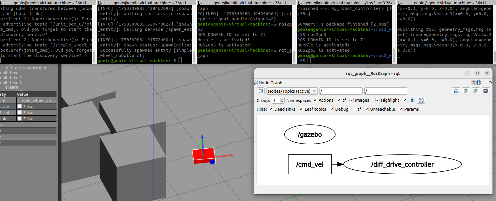

# 수행목표
Gazebo 시뮬레이터와 ROS2를 연동하는 방법을 학습한다.

## 1. URDF 파일의 Inertia, Collision 태그에 대해서 조사한다.
### 1-1. URDF의 inertial 태그
- <inertial> 태그는 링크(link)의 질량 특성과 관성 모멘트를 정의한다.
- 이는 물리 시뮬레이션에서 물체의 움직임을 현실적으로 표현하기 위해 필수이다.
### 1-2. URDF의 collision 태그
- <collision> 태그는 물체의 충돌 판정에 사용되는 형태(geometry)를 정의한다.

## 2. 앞에서 만든 간단한 로봇 모델에 Inertia, Collision 태그를 추가한다.
### 2-1. URDF 태그 정리
- `<link>`	로봇의 각 구성 요소 (몸통, 바퀴 등) 정의
- `<joint>`	링크 간의 연결과 움직임 정의
- `<visual>`	RViz, Gazebo에서 보이는 3D 시각 정보
- `<inertial>`	질량, 관성 모멘트 등 물리적 특성 정의
- `<transmission>`	하드웨어 <--> 컨트롤러 인터페이스 설정 (ros2_control 사용 시)
- `<gazebo>`	Gazebo 전용 플러그인	Gazebo에서만 동작 (플러그인, 색상 등)
- `<material>`	색상 정의 (Gazebo, RViz에 반영)
- `<geometry>`	도형 정의 (box, cylinder, sphere, mesh 등)
- `<origin>`	각 요소의 위치 및 자세 설정 (xyz, rpy)

## 3. Gazebo와 ROS2가 연동하는 방식에 대해서 조사한다.
### 3-1. ROS2 명령어로 Gazebo 실행
   - ros2 launch gazebo_ros gazebo.launch.py
### 3-2. 내가 만든 로봇 배치
   - ros2 run gazebo_ros spawn_entity.py -file ~/.../robot.urdf -entity my_robot 사용

   - ros2 run gazebo_ros spawn_entity.py   -file /home/genie/ros2_ws3/src/my_robot_controller3/urdf/simple_wheel_robot.urdf   -entity simple_wheel_robot.urdf

## 4. Gazebo 플러그인에 대해서 알아본다.
### 4-1. Gazebo 플러그인
 - Gazebo 플러그인(Gazebo Plugin) 은 Gazebo 시뮬레이터에서 로봇, 센서, 월드 등에 기능을 부여하거나 행동을 제어할 수 있는 C++ 기반 확장 코드이다.
 - URDF/SDF는 단지 모양(모델) 과 물리 특성만 정의한다.
 - 따라서 로봇을 움직이게 하거나 센서 데이터를 생성하려면 동작하는 코드가 필요하다.
 - Gazebo 플러그인은 그런 동작의 정의를 담당한다.
### 4-2. 설치된 Gazebo 플러그인을 확인
 - ls /opt/ros/humble/lib/ | grep gazebo_ros
### 4-3. Gazebo 플러그인 컨트롤러
 - diff_drive_controller: 2개의 바퀴로 움직이는 로봇을 제어하는 플러그인
 - camera plugin: 카메라 이미지를 퍼블리시하는 플러그인
 - lidar plugin: LiDAR 데이터를 퍼블리시하는 플러그인
### 4-5. 플러그인 작성 방법
`<plugin name="diff_drive_plugin" filename="libgazebo_ros_diff_drive.so">`  
  ...  
`</plugin>`

## 5. Gazebo 시뮬레이터에서 제작한 로봇 모델을 실행할 수 있도록 다음과 같은 과정을 수행한다.
1. 제어 노드 프로그램 circle_drive_node.py를 파이썬으로 구현한다. 이 제어 노드 프로그램은 Gazebo의 diff_driver_controller와 연결해 로봇이 적당한 크기의 원을 그리며 돌도록 제어한다.
2. Gazebo 시뮬레이터가 실행되고, 시뮬레이터 내에서 로봇이 움직이도록 Launch File을 작성한다.
3. 필요한 경우 package.xml과 setup.py 파일도 수정한다.

- /cmd_vel 토픽으로 메시지를 diff_driver_controller에 발행
 - 회전
   - ros2 topic pub /cmd_vel geometry_msgs/Twist "{linear: {x: 0.1}, angular: {z: 0.5}}"
 - 직진
   - ros2 topic pub /cmd_vel geometry_msgs/Twist "{linear: {x: -0.1}, angular: {z: 0.0}}"

## 6. 빌드, 실행 후 결과를 확인한다.

